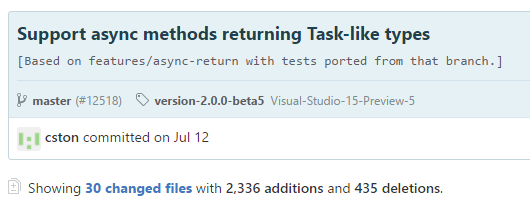
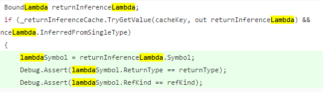

With VS 15 approaching a RC I felt it was time to give it a test run on some of our production code. Visual Studio
itself worked great, butI ran into some interesting issues while executing some of our unit tests. Everything was
compiling fine, but on a handful of tests I'd get the following runtime error

```text
Unhandled Exception: System.ArgumentException: Expression of type 'System.Int32' cannot be used for return type 'System.Nullable`1[System.Int32]'
   at System.Linq.Expressions.Expression.ValidateLambdaArgs(Type delegateType, Expression& body, ReadOnlyCollection`1 parameters)
   at System.Linq.Expressions.Expression.Lambda[TDelegate](Expression body, String name, Boolean tailCall, IEnumerable`1 parameters)
   at System.Linq.Expressions.Expression.Lambda[TDelegate](Expression body, Boolean tailCall, IEnumerable`1 parameters)
   at System.Linq.Expressions.Expression.Lambda[TDelegate](Expression body, ParameterExpression[] parameters)
   at ....
```

At first I didn't know what to make of it. Frustratingly enough the majority of the code that failing was either a
relatively complicated join statements in EntityFramework, or part of a complex validation rule that we set up with
FluentValidation. I could easily resolve the issue by with an explicit cast or even moving the expression to an
explicitly defined variable. But that would only fix the code I knew I had unit tests around, and we are far from 100%
code coverage. So I wanted to get to the heart of the issue.

Step one was trying to figure out how to reproduce it, but without code using a third party library. The
FluentValidation code was tightly wound to the external library so it was right out, but the EF queries I felt were a
good start. I could maybe just mimic the join that was failing using a couple of `List<>` and be good to go. I knew it
had to do with casting a nullable int to a regular int, so I took one of the failing queries and simplified it to the
point it still gave the error when running. Once I had that I replaced the `DbSet` with `List<>` and arrived with this:

```csharp
class Program
{
    static void Main(string[] args)
    {
        var invoices = new List<Invoice> { new Invoice { InvoiceId = 0 } };
        var oneTimeCharges = new List<OneTimeCharge> { new OneTimeCharge { Invoice = 0, OneTimeChargeId = 0 } };
        var otcCharges = invoices.Join(oneTimeCharges, inv => inv.InvoiceId, otc => otc.Invoice, (inv, otc) => inv.InvoiceId);
        Console.WriteLine(otcCharges.Count());
    }
}

public class OneTimeCharge
{
    public int OneTimeChargeId { get; set; }
    public int? Invoice { get; set; }
}

public class Invoice
{
    public int InvoiceId { get; set; }
}
```

Threw this into a console application, hit run aaaand....it worked. No error. I had already reproduced the issue using
FluentValidation so I knew the error could be triggered from this console app. Stumped for now I took the dog for a walk
and some fresh air. While walking I started thinking that the compiler shouldn't care about EF, but rather maybe the
collections being of type `IQueryable<>` was causing the lambdas to be compiled differently. I headed back inside and
threw an `AsQueryable()` onto the end of both definitions and hit run and....jackpot. Got the failure message, and I was
never happier to see some code fail.

Elated that I had a reproducible issue I naturally wanted to verify why it was happening. Luckily there's a great little
tool at http://tryroslyn.azurewebsites.net/. This site lets you view the compiled output of a C# app in a variety of
different Roslyn packages. So copied and paste my little app here, and checked out the code that was generated. I
compared both the version in VS 15 (master) and the current nuget release.

Armed with this I found the code at fault. In the current version the following code is produced:

```csharp
Expression<Func<Invoice, int?>> arg_EE_2 = Expression.Lambda<Func<Invoice, int?>>(Expression.Convert(Expression.Property(parameterExpression, methodof(Invoice.get_InvoiceId())), typeof(int?)), new ParameterExpression[]
{
    parameterExpression
});
```

In the version in VS 15 (master) this code is produced:

```csharp
Expression<Func<Invoice, int?>> arg_DF_2 = Expression.Lambda<Func<Invoice, int?>>(Expression.Property(parameterExpression, methodof(Invoice.get_InvoiceId())), new ParameterExpression[]
{
    parameterExpression
});
```

Note the missing `Expression.Convert`. Feeling good about myself for finding a reproducible test case I headed over to
Roslyn's Github repository to [file my bug](https://github.com/dotnet/roslyn/issues/14722).

A few days passed, and with my wife working night shifts I got the itch to see if I couldn't fix this myself. Heck, I
got a C+ in compiler construction in college - I surely could do this.

Step one was getting Roslyn up and running locally. This was easy enough, I just followed the instructions on the
[Building Testing and Debugging ](https://github.com/dotnet/roslyn/wiki/Building%20Testing%20and%20Debugging) page. I
walked through the instructions here to get the code building, and just to verify I did it right I ran the unit test
suite. 10 minutes later...success. But oomph that was a brutal wait. My current strategy of a guess and check bug fix
would be a long road to hoe if I didn't come up with a better plan.

Still, I now had the code running locally. So now I could get to work. It was time to try and track down precisely when
things broke. Hopefully with that information I could see what changed and figure out how to get it back to a working
state. A quick look at the difference between what's in VS 2015 Update 3 and VS15 unfortunately provide slightly
overwhelming.


But I did have a powerful thing at my disposal. My reproducible test case was an actual program. I can automate this.
Git has a nice tool called [`bisect`](https://git-scm.com/docs/git-bisect) just for this. TLDR of `git bisect` if you
haven't used it - you give it a starting and ending spot of what you consider good and bad commits plus a command to run
that returns an error code of 0 or 1 depending on if it passes. It then runs a binary search through the commits
executing the command and moving on. I'd compile roslyn on each pass, then use that version of the compiler to compile
my test case application, run it and check the error code returned. Thanks to the binary search of the bisect command
instead of 3,700 commits I'd only need like 12 or 13 runs. Nice!

This did involve some trial and error. It seems the output location of `csc.exe` changed as part of the changes since
Update3. No problem, nothing a little batch file `if` statement couldn't resolve. `Git bisect` also wasn't a huge fan of
the project.json files being modified in the build process so I also made sure to reset things before running my app so
bisect could do its thing cleanly. My script ultimately ended up looking like this:

```bash
call Restore.cmd
msbuild /v:m /m /p:Configuration=Release Roslyn.sln

IF EXIST Binaries\Release\Exes\csc\csc.exe (
Binaries\Release\Exes\csc\csc.exe expression.cs
) ELSE (
Binaries\Release\csc.exe expression.cs
)

git reset --hard
expression.exe
```

Expression.cs was my source and expression.exe was the compiled app. Time to launch the bisect. To do this I ran the
following commands while in the master branch, which was current failing

```bash
git checkout master
git bisect start
git bisect bad
git bisect good update3
git bisect run doit.cmd
```

I went to go refresh my drink and walk the dog. Ten minutes later I returned to the following message

```text

6c9e18649f576bd9df1e0db8ad21bfbce0454704 is the first bad commit
commit 6c9e18649f576bd9df1e0db8ad21bfbce0454704
Author: Charles Stoner <chucks@microsoft.com>
Date:   Tue Jul 12 13:51:14 2016 -0700

    Support async methods returning Task-like types

    [Based on features/async-return with tests ported from that branch.]

:040000 040000 5be0af3e25b7c68022d128a9adf5984e2eb03df3 d4ffb41d83a385fda5a1d60e04d488cf081d1a2f M      src
bisect run success
```

Fantastic. Looks like I found the guilty commit. Hopefully I could open this up and spot whatever changed relatively
quickly. Unfortunately, well, this was a huge commit.



Sigh. Lots of code to read, but it looked like quite a bit of it was unit tests. Knowing I was dealing with a lambda
issue there was one thing to do at this point - `CTRL-F` and search for lambda in the
[commit on github](https://github.com/dotnet/roslyn/commit/6c9e18649f576bd9df1e0db8ad21bfbce0454704). Eye balling the
highlighted results showed a couple of hot spots with `lambda` appearing frequently so I quickly scrolled there.



That looks like somewhere to start! But I needed a better way to test than hitting the command line and compiling over
and over again. I needed a unit test. I found a file named
[CodeGenExprLambdaTests](https://github.com/dotnet/roslyn/blob/master/src/Compilers/CSharp/Test/Emit/CodeGen/CodeGenExprLambdaTests.cs)
and figured this was as good as place as any to write my test. Opening this up I discovered a suite of tests that were
verifying compiler output and executing the results. Perfect! All I had to do was mimic their style and hopefully I
would be in business. Even better I noticed ReSharper picked up the tests so just maybe I could use ReSharper to only
run the test I was working on. In retrospect I probably should have started here, but oh well.

Thanks to a little copy and paste development from one of the existing tests I was able they have a nice way to run the
application and verify the output is correct. Very cool.

```csharp
[Fact]
public void ConversionAppliedInLambdaForNonMatchingTypes()
{
    var program = @"
using System;
using System.Collections.Generic;
using System.Linq;
namespace ConsoleApplication2
{
    class Program
    {
        static void Main(string[] args)
        {
            var invoices = new List<Invoice>().AsQueryable();
            var oneTimeCharges = new List<OneTimeCharge>().AsQueryable();
            var otcCharges = invoices.Join(oneTimeCharges, inv => inv.InvoiceId, otc => otc.Invoice, (inv, otc) => inv.InvoiceId);
            Console.Write('k');
        }
    }

    public class OneTimeCharge
    {
        public int OneTimeChargeId { get; set; }
        public int? Invoice { get; set; }
    }
    public class Invoice
    {
        public int InvoiceId { get; set; }
    }
}
";

    CompileAndVerify(
        sources: new string[] { program, ExpressionTestLibrary },
        additionalRefs: new[] { ExpressionAssemblyRef },
        expectedOutput: @"k")
        .VerifyDiagnostics();
}
```

I ran the unit test using R# with optimism, and instead of seeing an exception about casting I actually hit the
`Debug.Assert` I suspected. Nice!

```text
---------------------------
Assertion Failed: Abort=Quit, Retry=Debug, Ignore=Continue
---------------------------
   at Microsoft.CodeAnalysis.CSharp.UnboundLambdaState.ReallyBind(NamedTypeSymbol delegateType) in C:\Projects\phil-roslyn\src\Compilers\CSharp\Portable\BoundTree\UnboundLambda.cs:line 433
   at Microsoft.CodeAnalysis.CSharp.UnboundLambdaState.Bind(NamedTypeSymbol delegateType) in C:\Projects\phil-roslyn\src\Compilers\CSharp\Portable\BoundTree\UnboundLambda.cs:line 345
   at Microsoft.CodeAnalysis.CSharp.UnboundLambda.Bind(NamedTypeSymbol delegateType) in C:\Projects\phil-roslyn\src\Compilers\CSharp\Portable\BoundTree\UnboundLambda.cs:line 277
   at Microsoft.CodeAnalysis.CSharp.Binder.CreateAnonymousFunctionConversion(SyntaxNode syntax, BoundExpression source, Conversion conversion, Boolean isCast, TypeSymbol destination, DiagnosticBag diagnostics) in C:\Projects\phil-roslyn\src\Compilers\CSharp\Portable\Binder\Binder_Conversions.cs:line 300
   at Microsoft.CodeAnalysis.CSharp.Binder.CreateConversion(SyntaxNode syntax, BoundExpression source, Conversion conversion, Boolean isCast, Boolean wasCompi......

<truncated>
---------------------------
Abort   Retry   Ignore
---------------------------
```

That line of code matched exactly where I suspected from my quick code review. Just to confirm that my test would work
in the happy path, I quickly edited my unit test to a passing version without `AsQueryable` and ran it. Success! Good
news all around. Not only does the unit test runner work, but I had a great starting spot for what is going wrong.

The line of code in question that was failing was this section of code.

```csharp
if (_returnInferenceCache.TryGetValue(cacheKey, out returnInferenceLambda) && returnInferenceLambda.InferredFromSingleType)
{
    lambdaSymbol = returnInferenceLambda.Symbol;
    Debug.Assert(lambdaSymbol.ReturnType == returnType);
    Debug.Assert(lambdaSymbol.RefKind == refKind);

    lambdaBodyBinder = returnInferenceLambda.Binder;
    block = returnInferenceLambda.Body;
    diagnostics.AddRange(returnInferenceLambda.Diagnostics);

    goto haveLambdaBodyAndBinders;
}

```

Right there is the `Debug.Assert` failing when ReturnType doesn't equal whatever this `lamdaSymbol.ReturnType` is. Huh.
So it looks like they are caching previously generated expressions if they match, but it appears we are somehow pulling
one out that doesn't have a matching return type. Running the test through the debugger everything else seemed to jive,
just not this. This makes sense - in the release version the `Debug.Assert` wouldn't be there, but rather it would keep
moving forward and return the expression body for a lambda that was close but didn't have the right return type. That's
why I was only seeing it on complex joins and the such - I needed one statements where I had a similar lambda that
returned an int, and the same lambda with a slightly different return type. Subtle.

Now to fix. Looking at the end of the if statement I saw there was a check for `InferredFromSingleType` so I suspected
maybe just more filtering was needed on the cache. So I added one more check

```csharp
if (_returnInferenceCache.TryGetValue(cacheKey, out returnInferenceLambda) && returnInferenceLambda.InferredFromSingleType && returnInferenceLambda.Symbol.ReturnType == returnType)
...
```

Reran my test and...success! Happy days.

Armed with a reproducible unit test and a fix I mustered up the courage to
[submit a PR](https://github.com/dotnet/roslyn/pull/14755). After receiving some feedback I was pumped to see it
accepted and merged into the codebase hopefully in time for the VS 15 RC release.

## Postscript

To be honest, I never felt like I had gotten this implementation correct. It kind of felt like things were either being
put into or pulled out of cache improperly, and I was just filtering those out. And while I felt confident my fix
wouldn't introduce any issues thanks to its relatively local scope, I didn't have enough confidence to go digging in and
changing things related to how things were being compared for that object. I wasn't sure what behavior was really
expected. But a few days later I noticed a new issue pop up sparked by my PR
[new issue](https://github.com/dotnet/roslyn/issues/14774) around this. Looks like as I suspected my fix is just a
bandage, and the caching is in fact the true bug. I fully expect this issue's fix will cause my little addition to the
compiler to go away, but that's ok. Hopefully my test will remain to verify the behavior, and even if my tiny bit of
code isn't running in the compiler I'm still pretty happy to be able to contribute to something like Roslyn.
