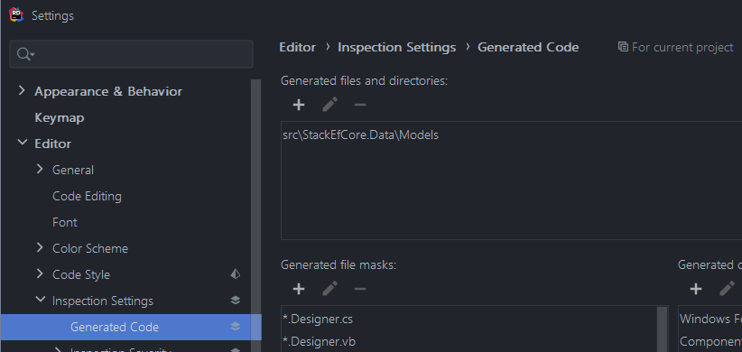

Entity Framework Core 5 is starting to take shape with Preview 7 being released in late July. When I need to play with
new data code, I like to use the [Stack Exchange Data Dump](https://archive.org/details/stackexchange). These are The
schema is simple enough, but with the variety of sized databases you can grab one that has enough data to make querying
against a SQL Server a little more like live fire especially when looking at execution plans.

## Building the Database

Step one is picking the right StackOverflow site database. These files are XML and are compressed pretty heavily so plan
accordingly. For example, the Coffee database sits at 3.5mb but expands out to 20mb. Once imported into SQL Server I was
looking at a 35mb database file.

Personally, I like using the
[math.stackexchange.com database](https://archive.org/download/stackexchange/math.stackexchange.com.7z). The 2gb
download expands into a nicely sized 18gb data. Not too large but enough data distributed around to make any bad queries
actually look bad. Next size up will be the StackOverflow.com databases themselves, but that gets into the 300gb
database size. If you got the bandwidth and disk space to spare go for it, but be prepared to wait a bit while
importing.

Once we have the 7z file downloaded we need to import them using the
[soddi tool](https://github.com/BrentOzarULTD/soddi) maintained by [Brent Ozar](https://www.brentozar.com/). These are
the steps I take when running the soddi tool

- Extract the xml files to a temp location with a filename matching the site e.g. `c:\stackdata\math`
- Create a new SQL Server database to house the data. I name them StackOverflowSite e.g. `StackOverflowMath`
- Install and run `soddi`
- Set the source field to your temp location without the site name e.g. `c:\stackdata`
- After you do this, you'll see the Sites on the right populate. Click the name of the database you want to import
- Set the Target to the database you just created e.g.
  `Data Source=.;Initial Catalog=StackOverflowCoffee;Integrated Security=True` and pick the appropriate provider.
- I leave the rest as is. I want the tags, indices and key created. The batch size you might want to tweak but I've
  never seen much of a difference. Full text indexing is something I have not used in 15 years so that gets left
  unchecked too.

Once you have done that click `Import`. With a database the size of the Math one be prepared to wait a minute.

## Scaffold the EF Core Model

Now that we have a database, we need to scaffold up the model. Since we are working with a preview release, we'll need
to do a few extra steps from the usual process. My target set up will be wo projects, a data project that is a .NET
Standard class library and a .NET Core xUnit project for running tests. The data project will house the models and
`DbContext`. Test project is for, well, the tests.

We'll build up our project from the command line

```shell
dotnet new sln
dotnet new gitignore
dotnet new classlib --name StackEfCore.Data --output src/StackEfCore.Data
dotnet new xunit  --name StackEfCore.Tests --output tests/StackEfCore.Tests
dotnet sln add src/StackEfCore.Data
dotnet sln add Tests/StackEfCore.Tests
```

Now that we have a project structure built, we need to add our nuget packages. The data project we'll add
`Microsoft.EntityFrameworkCore.SqlServer` and the test project will also need `Microsoft.EntityFrameworkCore.Design` for
the scaffolding tooling.

EF Core 5 will require .NET Standard 2.1. You'll need to edit the `StackEfCore.Data.csproj` to be

```xml
<Project Sdk="Microsoft.NET.Sdk">
  <PropertyGroup>
    <TargetFramework>netstandard2.1</TargetFramework>
  </PropertyGroup>
</Project>
```

Once the we've update the project to .NET Standard 2.1 we can add our references making sure we include the preview
version we want to target. We'll also go ahead and have our test project reference the data project while we are at it.

```shell
dotnet add .\tests\StackEfCore.Tests\ package Microsoft.EntityFrameworkCore.Design --version 5.0.0-preview.7.20365.15

dotnet add .\src\StackEfCore.Data\ package Microsoft.EntityFrameworkCore.SqlServer --version 5.0.0-preview.7.20365.15

dotnet add .\tests\StackEfCore.Tests\ reference .\src\StackEfCore.Data\
```

With that we have our project structure in place and ready for to scaffold the context. We'll use the preview version of
the EF tools to do that. Because this is in preview we don't want to install it globally just for playing around, so
We'll need to use the [.NET Core local tool](https://docs.microsoft.com/en-us/dotnet/core/tools/local-tools-how-to-use)
to install the preview bits.

```shell
dotnet new tool-manifest
```

This will create a `.config/dotnet-tools.json` file. With this in place we can install the preview bits of the EF Core
tools

```shell
dotnet tool install dotnet-ef --version 5.0.0-preview.7.20365.15
```

After this command has been ran the content of our .config/dotnet-tools.json file should look like this

```json
{
  "version": 1,
  "isRoot": true,
  "tools": {
    "dotnet-ef": {
      "version": "5.0.0-preview.7.20365.15",
      "commands": ["dotnet-ef"]
    }
  }
}
```

With our tool in place we are ready to scaffold. We'll use
[`dotnet ef dbcontext scaffold`](https://docs.microsoft.com/en-us/ef/core/miscellaneous/cli/dotnet#dotnet-ef-dbcontext-scaffold)
command but because we are running a local tool we'll need to use the `dotnet tool` command to do so. So, our syntax
will now be

```shell
dotnet tool run dotnet-ef dbcontext scaffold "server=.;database=StackOverflowMath;integrated security=true" Microsoft.EntityFrameworkCore.SqlServer --project .\src\StackEfCore.Data\ --startup-project .\tests\StackEfCore.Tests\
```

Note the `dotnet tool run`. That ensures we are using the local version. Without it you might run the old EF Core tool
if it's installed globally.

If you've been following along so far without the urge to open up your IDE of choice, go ahead and fire that up now.

## Let's Actually Run Some Code

After all that we can finally run a query or two. Open the generated `UnitTest1.cs` file and add some code in there to
verify it all works

```c#
[Fact]
public async Task Can_query_some_users()
{
    var context = new StackOverflowMathContext();
    var usersCount = await context.Users.LongCountAsync();
    Assert.True(usersCount > 0, "expected to find a user or two");
}
```

Now all that's left is to run `dotnet test` or use the test runner in your IDE of choice to verify that we are querying.

## Finishing Touches

If you are running Resharper or Rider you'll have quite a few warnings from the generated code, especially related to
unused getters and setters for your models. You have a couple of options. I personally like to mark the generated files
with the following comment. It'll disable inspections for the entire file.

```c#
// <auto-generated>
// This code was generated by ef scaffold.
// </auto-generated>
```

Another option would be to move the generated models and context into their own folder that is marked as generated in
your Resharper or Rider Options.



When you save these make sure to save them to your Team Shared Settings. This will create a
`solution-name.sln.dotsettings` file that you should commit to source control. Without this file in source control other
team members or build tools will continue to receive warnings.

Speaking of warnings, if for some reason you are going to production with this backup copy of the Stack Overlow database
or you decided to use your production database server for testing this out then make sure you adjust your `DbContext`
appropriately. Personally since I'm just messing around with integrated security against `(local)` I just delete the
warning.
