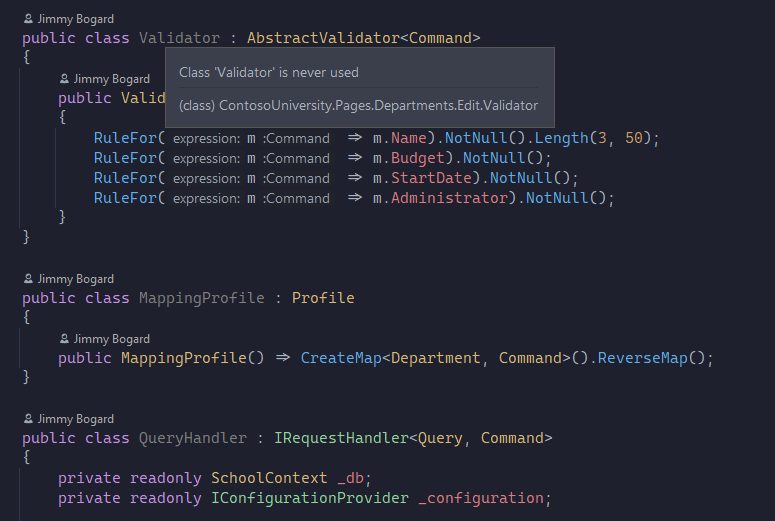
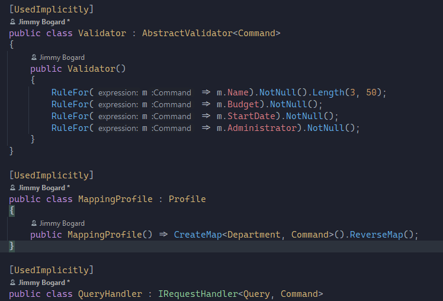
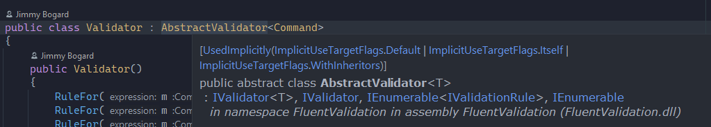

Three tools that repeatedly show up in my ASP.NET Core applications are AutoMapper, FluentValidation and MediatR. They
end up representing the bulk of the code in the web application portion of nearly all my web projects.

But one little thing starts to bother me when working with these libraries is ReSharper and Rider insistence that my
implementations of these tools are unused.



Take this sample code from
[Jimmy Bogard's Contoso University ASP.NET Pages demo application](https://github.com/jbogard/ContosoUniversityDotNetCore-Pages).
I can assure you that all three of the classes here are used, but their usage is discovered at runtime therefor the
inspections are blissfully unaware

- `Validator`. This class is dynamically created by FluentValidation. In `StartUp.cs` we tell FluentValidation to
  discover all validation classes in the assembly at runtime via the code

  ```csharp
   .AddFluentValidation(cfg => { cfg.RegisterValidatorsFromAssemblyContaining<Startup>(); });
  ```

- `MappingProfile`. Used by AutoMapper. Also in `StartUp.cs`. The code

  ```csharp
  services.AddAutoMapper(typeof(Startup));
  ```

  will scan the assembly looking for classes that inherit from `MappingProfile`

- `QueryHandler`. Used by MediatR. The code

  ```csharp
  services.AddMediatR(typeof(Startup));
  ```

  will scan our assembly registering handlers automatically.

Obviously it isn't the end of the world that we are getting these tips. But it would be nice for devs already not
familiar with this pattern to not get the warnings. One way we can overcome this is to install the
`JetBrains.Annotations` NuGet package. It contains the `[UsedImplicitly]` annotation. This annotation hints to the
inspector that the class is not instantiated directly.



While this solves the warning, it's ugly and gets repetitive real quick.

But there is hope. With the 2020 release of Rider and ReSharper the [UsedImplicitly] attribute got a new flag as one of
it's parameters -
[`ImplicitUseTargetFlags.WithInheritors`](https://www.jetbrains.com/help/resharper/Reference__Code_Annotation_Attributes.html#UsedImplicitlyAttribute).
What this flag does is tells the code inspector that all classes that inherit (or implement) this class are used
implicitly.

Unfortunately, we can't apply that attribute to the classes we need. They are all third party packages. One workaround
is we could create a class that inherits from the three we need to annotate, apply this annotation, and then change all
our code to use those instead. That's not much better than just applying the `[UsedImplicitly]` attribute directly
though.

## External Annotations to the Rescue

The analysis engine allows us to cheat.
[External annotations](https://www.jetbrains.com/help/resharper/Code_Analysis__External_Annotations.html) allow us to
create an xml file containing the types we want to annotate along with the specific annotation we want.

To do so we create a folder in the root of our solution named `ExternalAnnotations`. In this folder we'll create an XML
file matching each of our third party libraries (i.e. `AutoMapper.xml`, `MediatR.xml` and `FluentValidation.xml`).

The format of these files will look like this

```xml
<assembly name="{{library-name}}">
    <member name="{{ symbol-id of what-to-annotate }}">
        <attribute ctor="{{ symbol-id of attribute to apply}}" />
    </member>
</assembly>
```

E.g. for AutoMapper we want to apply the `UsedImplicitly` annotation to the `AutoMapper.Profile` type. To get the symbol
id we can use a ReSharper trick. You can click on the class you need to discover the symbol and click
`ReSharper Edit | Copy XML-Doc ID to Clipboard`. Clicking on `Profile` and running this command copies
`T:AutoMapper.Profile` to our clipboard. I don't think this feature exists in Rider so you will need to use ReSharper.
The second step involves finding the constructor of the attribute we want to apply. The secret to doing this is to
search the internet and find an external annotation that already has applied it and copy and paste.

Given this we can now generate our full annotation

```xml
<assembly name="AutoMapper">
    <member name="T:AutoMapper.Profile">
        <attribute ctor="M:JetBrains.Annotations.UsedImplicitlyAttribute.#ctor(JetBrains.Annotations.ImplicitUseTargetFlags)" >
            <argument>5</argument>
        </attribute>
    </member>
</assembly>
```

The 5 in this case comes from the flag `ImplicitUseTargetFlags` definition. We want `WithInheritors` and we might as
well add `Itself` too.

```csharp
[Flags]
public enum ImplicitUseTargetFlags
{
    Default = 1,
    Itself = Default, // 0x00000001
    /// <summary>Members of entity marked with attribute are considered used.</summary>
    Members = 2,
    /// <summary> Inherited entities are considered used. </summary>
    WithInheritors = 4,
    /// <summary>Entity marked with attribute and all its members considered used.</summary>
    WithMembers = Members | Itself, // 0x00000003
}
```

Armed with this knowledge we can create an xml file for MediatR and FluentValidation. For MediatR we'll want to annotate
`IRequestHandler<>`. The code for that is

```xml
<assembly name="MediatR">
    <member name="T:MediatR.IRequestHandler`2">
        <attribute ctor="M:JetBrains.Annotations.UsedImplicitlyAttribute.#ctor(JetBrains.Annotations.ImplicitUseTargetFlags)" >
            <argument>5</argument>
        </attribute>
    </member>
</assembly>
```

For FluentValidation we want `AbstractValidator<>`. The code for that is

```xml
<assembly name="FluentValidation">
    <member name="T:FluentValidation.AbstractValidator`1">
        <attribute ctor="M:JetBrains.Annotations.UsedImplicitlyAttribute.#ctor(JetBrains.Annotations.ImplicitUseTargetFlags)" >
            <argument>5</argument>
        </attribute>
    </member>
</assembly>
```

After we create the file we will need to close our solution. You might even need to shut Visual Studio and/or Rider all
the way down and restart them.

But once you reload your solution, your handlers, validators and profiles should no longer be marked as unused. If you
want to verify the attribute has been applied you can select one of the classes we wrote the external annotations for
and choose "Quick Documentation" (`CTRL-SHIFT-F1`).



Here we see the `UsedImplicitly` flag being applied.

## Conclusion

I've never been a huge fan of littering `[UsedImplicitly]` throughout my code. But with the new addition of
`WithInheritors` not only is it easier to apply I feel applying this at the interface or base class level it is more
descriptive than on the implementation itself when working with DI. For example if you had a generic repository you
could mark `IRepository<>` with the interface. Now classes that properly implement that interface will be marked while a
class that does not will remain marked as unused. Maybe one day the analysis engine will be able to dynamically load
these classes that are used implicitly, but until then this is a decent workaround.

To see these changes in action (well, lack of action I guess) check out the sample repository. And feel free to copy and
paste the `ExternalAnnotations` folder into your application, restart your IDE and see your unused warnings go away.
