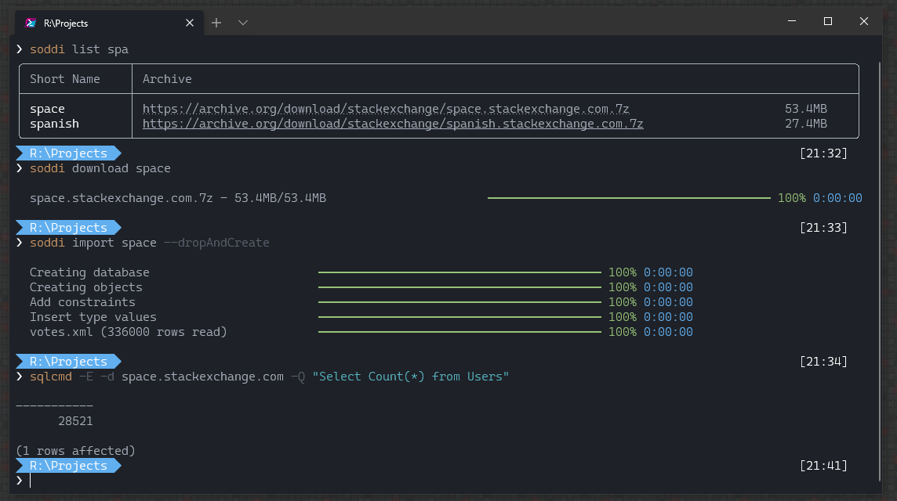

Whenever I get into learning a new technology around data access, there is always the issue of finding a good database to work against. Long gone are the days of Northwind. You need a database not with just a lot of rows, you need a database with a interesting and varied distribution of data. The databases I turn to are the [Stack Exchange archives](https://archive.org/details/stackexchange). These frequently updated archives contain anonymized exports from all the Stack Exchange sites, from the tiny [Sports](https://sports.stackexchange.com/) all the way to the huge main site [Stack Overflow](https://stackoverflow.com/). With hundreds of sites to pick from, I can grab a fresh database of whatever size that matches my need. With sites ranging from 2mb to over 100gb of data you can find a database with real data for playing with that fits your size. The schema is simple, well defined and has a variety of real-world data making it perfect for playing with SQL Server indexing strategies, or testing out the latest Entity Framework version.

The archives themselves are just huge xml files, ready to be used for whatever. For me, that means SQL Server. Getting these into your database server I've always relied on [Soddi](https://github.com/BrentOzarULTD/soddi). Originally written by Sky Sanders, and now maintained by Brent Ozar's team, it smooths out importing the 7z files into your database server. And it works well.

But I tend to run into the same set of problems every time I want to grab one of these archives.

- For the larger sites, the download times are brutal over HTTP. Torrenting works best, but I typically don't have a torrent client running on my dev machines. And I so infrequently do need a client it seems whatever one I used last has been sold to some dodgy company.
- They are packed as 7z archives. Same as the previous issue, I typically don't have 7-zip installed on my dev machines as I don't really mess with archives that often. Installing 7-zip isn't a big deal, but one I'd like to avoid if possible.
- With the larger databases you need to full expand the archive out before importing it. You need well over 150gb of storage to import that Stack Overflow database
- The existing SODDI application is not terribly intuitive. You need to get your folder structure set up in a particular way. It never feels like I flip the right levers on the first try.
- When I'm messing with the SO databases, I'm usually doing some crazy things with the database so dropping and recreating it is a frequent task. Like to make the full import process quick and easy as possible.

With that in mind (and after I read a couple of articles around creating dotnet tools) I decided I'd try and create a modern CLI version of SODDI.

## dotnet soddi



Because dotnet-soddi is a dotnet tool, you install it using the `dotnet tool install` command. As of right now, it's still in (very) pre-release so a version number will be needed e.g.

```bash
dotnet tool install --global dotnet-soddi --version 0.1.1
```

You can also clone and run it from it's repository at <https://github.com/phil-scott-78/dotnet-soddi>.

Once installed there are four main commands

- `list`
- `download`
- `torrent`
- `import`

`list` will display all the archives available along with their file size. You can specific a filter to only include a partial list. E.g. `soddi list spa`, which will only include archives with spa in their name.

`download` will download the archive over HTTPS. This is preferred for smaller sized files (less than 100mb) so you don't need to worry about the overhead of bittorrent.

`torrent` use bittorrent to download the archives. For larger archives, especially things like math and the main site, this is almost needed. On my machine, I'll max out at 35mbps over http, but have seen the torrent download reach up to 600mbps depending on the other peers connected)

`import` is where the real magic happens.

Import will take a given .7z file, and simultaneously extract and perform a bulk insert into SQL Server. No need for scratch space for the extracted files, it streams directly to your SQL Server. Not only keeping disk space requirements low, but it also keeps memory usage low. Even a 50gb import rarely reaches over 65mb of memory used on my machine.

By default, import will expect the destination database to be created and empty with a name matching the site (e.g. `stackoverflow.com` or `math.stackexchange.com`). With many of these databases having large sizes, this allows you to fine tune the log and data locations before the import. If you are ok with blindly creating the DB in the default locations, the `-–dropAndCreate` option will take care of that for you. It won't check for disk space or anything ahead of time so use with caution.

During this process, keys and indexes will be created as well as a helper table named PostTags. These can be turned off with a switch if so desired.

## Sample Workflow

1. `soddi list spa` - this lists all archives containing the phrase "spa"
2. `soddi download space` - you can use either the full site name (space.stackexchange.com) or the short name to download. we'll use the short name, and it'll download a file whose name matches the site name.
3. `soddi import space.stackexchange.com.7z --dropAndCreate` - import the space.stackexchange.com.7z file we just downloaded. the `--dropAndCreate` option will drop any database named space.stackexchange.com and recreate it using your server's configured defaults. `soddi import -h` will give you more options for specifying a connectionstring and specifying a database name.

Once the import is done, you'll have a local copy of the Stack Exchange database of your choice!

## Database Info

If you've never worked with the Stack Exchange schema, here's a few helpful pieces of documentation

- [Schema description](https://meta.stackexchange.com/questions/2677/database-schema-documentation-for-the-public-data-dump-and-sede/2678#2678)
- [Schema diagram](https://i.stack.imgur.com/AyIkW.png)
- [Sample queries](https://data.stackexchange.com/stackoverflow/queries)

## Technical Notes

A few technical notes on the app itself

- Uses [Spectre.Console](https://github.com/spectresystems/spectre.console) for console rendering and CLI input.
- Uses [SharpCompress](https://github.com/adamhathcock/sharpcompress) for extracting 7z files.
- Uses [MonoTorrent](https://github.com/alanmcgovern/monotorrent) for torrent downloading.
- For bulk inserts, it creates the index and leaves them updating prior to the insertion. Typically you wouldn't do this for performance reasons, but with the decompression being a bottleneck, SQL Server has plenty of time to keep the indexes up to date.
- Decompression is single threaded, and extremely CPU bound. If someone can figure out a way to decompress on multiple threads, PRs are certainly welcomed.
