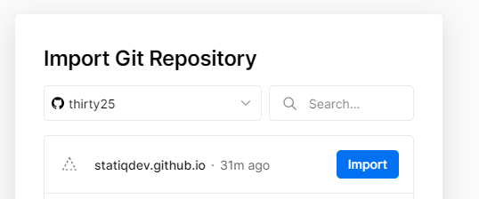
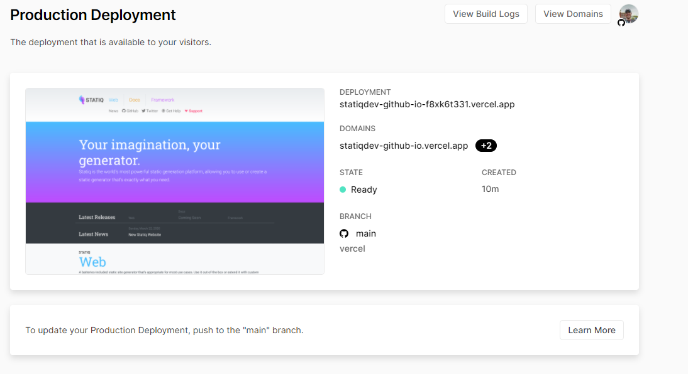

[Vercel](https://vercel.com) (formerly Zeit) is a platform for hosting static sites and serverless functions. They provide a lot of services for free that make it perfect for hosting your developer blog:

- A seamless integration with Git for automated deployments
- Free SSL on custom domains
- Automatic creation of additional development deployments based on branching and pull requests
- Fast edge servers - no need for configuring any CDN here

While most projects that they host are Next.js, Svelt, Nuxt.js or Gatsby sites, there's no reason we can't use it to host our [Statiq](https://statiq.dev) sites as long as we can play within their sandbox properly.

A few things we need to keep in mind before moving over our site:

- Vercel will run our deploy on Linux servers. This means casing matters. A big gotcha I ran into was casing of `_ViewStart` and `_ViewImports`. Make sure they are properly capitalized.
- Vercel will by default run `npm run build` to build our site
- Vercel will look in the `public` folder for the output rather than the default `output` folder of Statiq. Either we'll have to change that in a setting of your Vercel site, or tell Statiq the right folder for output.
- Vercel does not support clean URLs by default (e.g. `/tags` rather than `/tags.html`). We can adjust that easily though.

Ok, given this knowledge I'm going to try and get the Statiq website hosted. The repository is <https://github.com/statiqdev/statiqdev.github.io>. One gotcha is that because the Statiq docs are hosted on github pages, the main branch is currently set up as the content of the site. With Vercel we don't want that. Your `main` branch will be the code that generates your production site. `git reset develop --hard` while on the main branch will get things pointed in the right direction. If you don't do that we can still work with just the develop branch and ignore main, we just won't have a production site in Vercel.

Let's tackle our bullet list of things to keep in mind. First, we are lucky because the casing is already correct for `_ViewImports` and `_ViewStart` for this project. So we can jump right to the second step.

I'm sure that if I was smart enough I could write a bash script that installs dotnet and run it directly from that. But I'll typically be using npm anyways, so I'll stick to npm. Luckily we have a couple of npm packages ready for us with [dotnet-sdk-3.1](https://www.npmjs.com/package/dotnet-sdk-3.1) and [dotnet-sdk-cli-3.1](https://www.npmjs.com/package/dotnet-sdk-3.1). To quickly get started we can run

```bash
npm init -y
npm install dotnet-sdk-3.1 dotnet-sdk-cli-3.1
```

This will initialize npm with defaults and then install the packages for wrapping .NET 3.1 for our needs.

With this in place, we need to add our `build` command to npm. Open up the newly created `package.json` and find the scripts. While I'm in here I'll one script for launching the preview along with the build command. Keep in mind that we need to output to the `public` folder too.

With that in mind, our scripts section will now look like this

```json
 "scripts": {
    "build": "dotnet run -- -o public",
    "watch": "dotnet run -- preview"
 },
```

The last step is making configuring Vercel to use the clean urls that Statiq will generate. Thankfully, this is just a [config toggle](https://vercel.com/docs/configuration#project/clean-urls). To do this we can create a `vercel.json` file in the root and add the following configuration to it

```json
{
  "cleanUrls": true
}
```

With that in place, we can commit our changes and push.

## Setting up Vercel

There is a ton to do in Vercel, but that's for a later blog post. For now let's just get our site imported into Vercel. First, head to <vercel.com> and log in with GitHub credentials. With that done we can now import our recently created project.



Once you've selected your project that rest is just accepting the defaults. Once this completes, it should kick off a build of your site and show you the completed screen.



My site is living at <https://statiqdev-github-io.vercel.app/> and you are welcome to check it out.

From here you'll notice a few things. The build has multiple urls. It has a url for the commit, one for the branch name and also one that acts as the product site. You can also easily add custom domains to act as your production site and you'll see this pop up here.

If you create a branch and push to it, it will create a new deployment separate from this one that acts as a development site. They all in this case point to the same build. Try and create a branch from main with a CSS change and push it up and you'll get a couple new URLs to use based off of the branch name and commit hash.

The branching model is the killer feature for blogging for me. I have terrible spelling and grammar as you have surely noticed. By being able to create a branch per post I'm (theoretically) able to send it to a proof reader who can look it over on the site as it would be displayed in production as part of a pull request. GitHub comments can be used to review it, and Vercel keeps it all in sync. Finally, when I merge the PR (or schedule it) the post goes to main and Vercel builds and deploys the site.

Magic.
