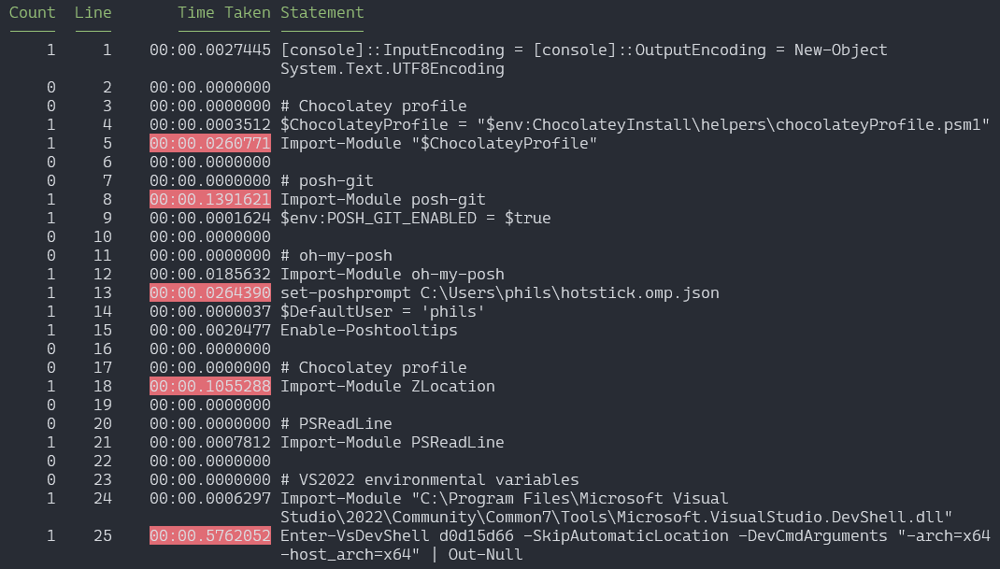

Sometimes I just want to drop into my shell and get things done without a GUI or any other things slowing me down. I love PowerShell and Windows Terminal, but the idea I'm hoping into speedy power-mode is dashed when I sit and watch an empty screen load things up and a little message telling me how slow it is.

Not that PowerShell is at fault here. These performance issues are self-inflected, of course. I have multiple tools running to make my experience better, and with tools loading comes load times. Right now my PowerShell profile requires the following tools, and at this point I'm not sure I can live without them.

- [oh-my-posh](https://ohmyposh.dev/). Prompt theming. A must have.
- [posh-git](https://github.com/dahlbyk/posh-git). Enhancements for git in PowerShell
- [PSReadLine](https://github.com/PowerShell/PSReadLine). Improvements for the command line editing experience.
- [Visual Studio Developer Command Prompt and Developer PowerShell](https://docs.microsoft.com/en-us/visualstudio/ide/reference/command-prompt-powershell?view=vs-2022). Adds common Visual Studio paths and environmental variables to the path.
- [ZLocation](https://github.com/vors/ZLocation). Tracks most common directories used and let's you quickly jump to them with the `z` command.
- [Chocolatey](https://chocolatey.org/). Package manager.

Each tool I can't live without, but each tool needs to be imported each time I launch a new shell. It's not the end of the world, but clicking that button and seeing a blank screen followed by this doesn't sit right with me

```
PowerShell 7.2.0
Copyright (c) Microsoft Corporation.

https://aka.ms/powershell
Type 'help' to get help.

Loading personal and system profiles took 1234ms.
```

We can make this faster.

## Our Profile

I'm going to assume you are already familiar with [PowerShell profiles](https://docs.microsoft.com/en-us/powershell/module/microsoft.powershell.core/about/about_profiles?view=powershell-7.2). For my purposes I do everything in the "Current user, Current host" profile which you can edit by running `notepad $PROFILE`.

Here's my profile as a starting point for our performance tuning. Most of it is pretty straight forward and copied right from the different modules' getting started guide. The first line might not make sense at first, but it's forcing the console to be UTF8. This allows our console apps to use advanced unicode output e.g. rocket ship emojis.

```powershell
[console]::InputEncoding = [console]::OutputEncoding = New-Object System.Text.UTF8Encoding

# Chocolatey profile
$ChocolateyProfile = "$env:ChocolateyInstall\helpers\chocolateyProfile.psm1"
Import-Module "$ChocolateyProfile"

# posh-git
Import-Module posh-git
$env:POSH_GIT_ENABLED = $true

# oh-my-posh
Import-Module oh-my-posh
set-poshprompt C:\Users\phils\hotstick.omp.json
$DefaultUser = 'phils'
Enable-Poshtooltips

# Chocolatey profile
Import-Module ZLocation

# PSReadLine
Import-Module PSReadLine

# VS2022 environmental variables
Import-Module "C:\Program Files\Microsoft Visual Studio\2022\Community\Common7\Tools\Microsoft.VisualStudio.DevShell.dll"
Enter-VsDevShell d0d15d66 -SkipAutomaticLocation -DevCmdArguments "-arch=x64 -host_arch=x64" | Out-Null

```

The last section where I load the Visual Studio Command Line. I got this script from reverse engineering the profile that is automatically added to Windows Terminal. Depending on your version of Visual Studio it may (and almost certainly will) be different. Alternately, you can use [this gist that will search for the latest VS version and use it](https://gist.github.com/ArthurHNL/b29f008cbc7a159a6ae82a7152b1cb2a). I've found it adds even more time so I'm ok with hard coding the path and other script values. The very last line redirects the output to `Out-Null` simply because I don't want the big default loading banner.

While it is a simple profile, launching it results in a blank screen followed by PowerShell telling me that my profile loaded in over a second. To me, that's pretty darn slow, especially on modern hardware.

## Finding Out What's So Darn Slow

So let's find out what the hold up is. First things first, I want to create a new Windows Terminal Profile for launching PowerShell without a profile. We are going to do some measuring of our script speed and it is critical nothing is loaded when we do so. To do so create a new profile and set the command line to `pwsh.exe -noProfile`.


We need to do this because we are going to use a profiling tool to measure the script line-by-line. The tool I like to use is [PSProfiler](https://github.com/IISResetMe/PSProfiler). I personally use the `1.0.5-preview1` release which includes a a nice feature for highlighting the slowest lines.

First we need to install the module by running

```powershell
Install-Module -Name PSProfiler -AllowPrerelease
```

Because we won't be using this all the time I won't include this in my PowerShell profile, but I'll instead run `Import-Module PSProfiler` when needed.

Once this is installed, start a new terminal tab using our "PowerShell No Profile" option. This should launch in a flash giving us a glimmer of hope of what we can accomplish. We have nothing loaded yet which means PSProfiler will get a true measurement of the time it takes to import all our modules. To do so we run the following command

```powershell
Import-Module PSProfiler
Measure-Script -Path $PROFILE -Top 5
```

This script will launch our profile and measure each line's performance. With the `-Top` command it'll also go ahead and highlight the top 5 slowest lines.



Taking a look at my script's performance we can see that while posh-git and zlocation are both taking over 100ms each, it's loading up the Visual Studio Shell that's really eating up some time. It's over half a second by itself. Unfortunately that half a second is going to be the fastest we can run our profile. It's a single line and we have to live with it.

But, there is good news. It's actions don't impact the other modules. We can load it in parallel while the other items load too. The way we can do this is via [`Start-ThreadJob`](https://docs.microsoft.com/en-us/powershell/module/threadjob/start-threadjob?view=powershell-7.2). This will create a background-job we can use for loading this module. The code for this will be

```powershell
$vsshell = Start-ThreadJob {
  Import-Module "C:\Program Files\Microsoft Visual Studio\2022\Community\Common7\Tools\Microsoft.VisualStudio.DevShell.dll"
  Enter-VsDevShell d0d15d66 -SkipAutomaticLocation -DevCmdArguments "-arch=x64 -host_arch=x64" | Out-Null
}
```

This code should be at very top of our script before any other modules run. It needs to launch immediately. The rest of our script stays the same and they run side-by-side while `Enter-VsDevShell` does it's thing. But, because the VS shell script is so slow, the other items will complete before our background job. That means before we exit our profile we need to tell our script to wait for our background job to complete. To do so we run

```powershell
Receive-Job $vsshell -Wait -AutoRemoveJob
```

This uses the variable we stored our job to tell powershell to wait for it to complete and go ahead and remove it too. This should be the last thing our script does.

We can save our profile and relaunch a new PowerShell instance. It still won't be as fast as running with no profile, but with any luck it should be around a half second or faster now as we are able to load everything else while `Enter-VsDevShell` is running. On my machine, this shaves around 300ms as everything completes and waits 200ms additional seconds for the VS shell to be built. This gets me below 500ms pretty consistently which I can live with.

## Adding Visual Feedback

Since we are stuck with half-second load time there is another trick we can do to at least make it seem like it's loading fast - display stuff. Seeing the screen do something is at least better than blank screen, so let's add some feedback. The pattern I've landed on is displaying "Loading _module name_" followed by a check mark once it is loaded. To do this I created a function to keep it consistent.

```powershell
function Run-Step([string] $Description, [ScriptBlock]$script)
{
  Write-Host  -NoNewline "Loading " $Description.PadRight(20)
  & $script
  Write-Host "`u{2705}" # checkmark emoji
}
```

This function takes a description that I want to display and a script block. It displays my text, runs the script and finally writes an emoji checkmark. An example call would be

```powershell
Run-Step "Posh-Git" {
  Import-Module posh-git
  $env:POSH_GIT_ENABLED = $true
}
```

Keep in mind, however, that we are running two threads here. I keep all the UI off the background thread that's loading the dev shell stuff. I wrap the `Receive-Job` in the `Run-Step` command. This has the added benefit of about every 100ms a new line is printed to the screen with the final one being the completion of the VS Shell import.

I do a few other things to keep things moving fast. I include the `-noLogo` switch for my PowerShell profile in Windows Terminal to hide the default logo display and use my own. This has the added benefit of not checking for a new version of PowerShell which does speed things up a tad. Since we won't have the typical PowerShell banner, I roll my own.

This results in our final script.

```powershell
function Run-Step([string] $Description, [ScriptBlock]$script)
{
  Write-Host  -NoNewline "Loading " $Description.PadRight(20)
  & $script
  Write-Host "`u{2705}" # checkmark emoji
}

[console]::InputEncoding = [console]::OutputEncoding = New-Object System.Text.UTF8Encoding

Write-Host "Loading PowerShell $($PSVersionTable.PSVersion)..." -ForegroundColor 3
Write-Host

# this takes a sec, but we can also do it concurrently with the rest of the profile loading
$vsshell = Start-ThreadJob {
  Import-Module "C:\Program Files\Microsoft Visual Studio\2022\Community\Common7\Tools\Microsoft.VisualStudio.DevShell.dll"
  Enter-VsDevShell d0d15d66 -SkipAutomaticLocation -DevCmdArguments "-arch=x64 -host_arch=x64" | Out-Null
}

# Chocolatey profile
Run-Step "Chocolatey" {
  $ChocolateyProfile = "$env:ChocolateyInstall\helpers\chocolateyProfile.psm1"
  Import-Module "$ChocolateyProfile"
}

# posh-git
Run-Step "Posh-Git" {
  Import-Module posh-git
  $env:POSH_GIT_ENABLED = $true
}

# oh-my-posh
Run-Step "oh-my-posh" {
  Import-Module oh-my-posh
  set-poshprompt C:\Users\phils\hotstick.omp.json
  $DefaultUser = 'phils'
  Enable-Poshtooltips
}

# Chocolatey profile
Run-Step "ZLocation" {
  Import-Module ZLocation
}

Run-Step "PSReadline" {
  Import-Module PSReadLine
}

# we already started this task earlier, just gotta receive it now
Run-Step "VS2022 Shell" {
  Receive-Job $vsshell -Wait -AutoRemoveJob
}
```


## Really Stretching for Performance

If you are still seeing things go slow, there is one last thing to try - working around Windows Defender. We are loading quite a bit of code on start up, many times from locations that defender hasn't scanned recently. This can add some serious delays. Run your script with it enabled a few times to get a baseline, then disable it and run it a few more times. This will give you an idea if it is the culprit.

I'm not going to provide a recipe for how to speed it up, but I've had good luck using [Process Monitor](https://docs.microsoft.com/en-us/sysinternals/downloads/procmon) and adding filtering on the `MsMpEng.exe` process. From there I go through the paths that show up frequently and just make a judgement call on whether or not they should be hit that often.

Personally, I do not like to add processes to my exclusion list. The idea of adding `pwsh.exe` as something that Defender is ignoring is a step too far for me. I want that process monitored. But my personal comfort level of safety I do feel ok adding paths like `C:\Program Files\PowerShell` to the exclusion list. By filtering out folders that I feel other pieces of Windows should be keeping safe, I can find a good middle ground between performance and security that works for me.
