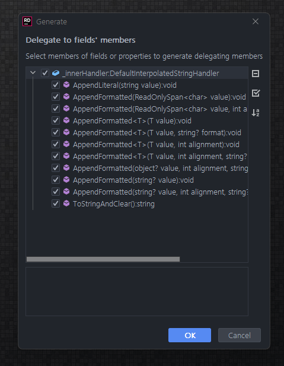

A common mistake when using [markup](https://spectreconsole.net/markup) with Spectre.Console is forgetting to escape values when creating your markup strings. Take, for example, this seemingly safe call.

```csharp
var name = AnsiConsole.Ask<string>("What's your name?");
AnsiConsole.MarkupLine($"The value is [blue]{name}[/]");
```

This compiles just fine, this runs just fine. And everything is ok until someone enters their name as "Mr. [".

This results in this exception

```text
Unhandled exception. System.InvalidOperationException: Encountered unescaped '[' token at position 27
   at Spectre.Console.MarkupTokenizer.MoveNext() in /_/src/Spectre.Console/Internal/Text/Markup/MarkupTokenizer.cs:line 118
   at Spectre.Console.MarkupParser.Parse(String text, Style style) in /_/src/Spectre.Console/Internal/Text/Markup/MarkupParser.cs:line 23
   at Spectre.Console.AnsiConsoleExtensions.Markup(IAnsiConsole console, String value) in /_/src/Spectre.Console/Extensions/AnsiConsoleExtensions.Markup.cs:line 41
   at Spectre.Console.AnsiConsoleExtensions.MarkupLine(IAnsiConsole console, String value) in /_/src/Spectre.Console/Extensions/AnsiConsoleExtensions.Markup.cs:line 62
   at Spectre.Console.AnsiConsole.MarkupLine(String value) in /_/src/Spectre.Console/AnsiConsole.Markup.cs:line 46
   at Program.<Main>$(String[] args) in R:\thirty25\spectre-console-string-interpolation\src\StringInterpolation\Program.cs:line 4

```

Ouch. The proper way this code needs to be written is to escape all user supplied values. This involves replacing all `[` with `[[` and `]` with `]]`. To make this easy there is even a helper

```csharp
var name = AnsiConsole.Ask<string>("What's your name?");
AnsiConsole.MarkupLine($"The value is [blue]{name.EscapeMarkup()}[/]");
```

This, I'll admit, is annoying and easy to forget especially on longer lines. But modern problems have modern solutions! Because we are using string interpolation there are a couple of techniques we can use to tackle this. One is by using `FormattableString`.

## `FormattableString` to the Rescue

[`FormattableString`](https://docs.microsoft.com/en-us/dotnet/api/system.formattablestring?view=net-6.0) has been around since C# 6. Instead of a `string` your method instead takes a `FormattableString` as the parameter telling the compiler you don't want it to do any magic but rather send the interpolated string right to your method. This results in all the format data to be passed rather than the results of the formatting.

We can add a new method named `MarkupLineInterpolated` that accepts this parameter and auto-escape the string arguments. `FormattableString` exposes a method named `GetArguments` that contains an array of all the interpolated expression items, and a `Format` property containing the format string that defined the interpolated example. E.g. with the previous example `GetArguments()` returns an array with a single item of our string `name` and the `Format` property is set to `The value is [blue]{0}[/]`.

Given these two properties we can take pass into `string.Format` our format string and a new array with all string values formatted.

```csharp
static class AnsiConsoleExtensions
{
    public static void MarkupLineInterpolated(this IAnsiConsole console, FormattableString formattableString)
    {
        var args = formattableString
            .GetArguments()
            .Select(i => i is string s ? s.EscapeMarkup() : i)
            .ToArray();

        console.MarkupLine(string.Format(formattableString.Format, args));
    }
}
```

Now when we call our method we can do so without worry about escaping our strings

```csharp
console.MarkupLineInterpolated($"The value is [blue]{name}[/]");
```

Cédric Luthi has a quite [nice implementation as a pull request](https://github.com/spectreconsole/spectre.console/pull/564) that breaks down all the different combinations including working with `IFormatProvider`. I recommend taking a look at his entire solution; it's quite well done.

## The C# 10 and .NET 6 Solution

Our `MarkupLineInterpolated` functions quite well, but there are a few things that could be better. It allocates quite a bit. We are creating a new array with new strings, then we are building a another string with `string.Format` with all the concerns of boxing before ultimately sending that to `MarkupLine`. Now, I'll be the first to admit that Spectre.Console isn't exactly in need of a high performance solution here. Bare with me though, we are gonna make it as fast as possible because, well, it sounds like fun.

A feature introduced with C# 10 is [interpolated string handlers](https://docs.microsoft.com/en-us/dotnet/csharp/language-reference/proposals/csharp-10.0/improved-interpolated-strings#the-handler-pattern) and the handler pattern. Interpolated string handlers help guide the compiler to creating an optimized set of commands for working with the interpolated strings. What's great about them is that even if you don't know about them, chances are you have probably already lucked into using them if you are on C# 10. Every string interpolation usage will automatically use one named `DefaultInterpolatedStringHandler`. Just upgrading to the latest version of C# and .NET will give you a boast in speed. Stephen Toub has an excellent [blog post that breaks down all this magic](https://devblogs.microsoft.com/dotnet/string-interpolation-in-c-10-and-net-6/) that I highly recommend reading. But I recommend reading it after working through our much simpler example because it gets technical quick. I assure you, I'll save getting complex for Stephen.

### Building MarkupInterpolatedStringHandler

When the compiler encounters an interpolated string it'll, by default, use the aforementioned `DefaultInterpolatedStringHandler`. If we let the compiler know we have our own handler, we can override that behavior.

Before we start, I got to warn you that the syntax for these handlers isn't exactly obvious. Remember the compiler is using this during build time so it'll have some nuances that don't match common C# patterns.

To get started, we need to define our handler. The minimal example for this will be

```csharp
[InterpolatedStringHandler]
public struct MarkupInterpolatedStringHandler
{
    public MarkupInterpolatedStringHandler(int literalLength, int formattedCount){
    }
}
```

The attribute marks our struct as the interpolated string handler. The constructor our struct must have these two parameters. `literalLength` is the number of literal characters in the interpolate string. `formattedCount` is the number of interpolated expressions. E.g. given the interpolated string

```csharp
var s = $"My name is {name} and my age is {age}"
```

then `literalLength` would be 26 and `formattedCount` would be 2. This data can be calculated at compile time so it's cheap to include for runtime usage. Fun fact, the default usage uses it to preallocate the buffer under the assumption that total length of the created string is definitely going to be `literalLength` characters long plus they estimate the average expression item is about 11 characters long. So we'll borrow that and use it to create a default sized `StringBuilder` instance.

Finally we add a method named `ToStringAndClear` which is a common name that is used to finally build out the results of the handler. In our case that's calling `ToString` on our `StringBuilder` and returning the value.

```csharp
[InterpolatedStringHandler]
public struct MarkupInterpolatedStringHandler
{
    private readonly StringBuilder _markupStringBuilder;

    public MarkupInterpolatedStringHandler(int literalLength, int formattedCount, StringBuilder? stringBuilder = null)
    {
        _markupStringBuilder = new StringBuilder(literalLength + formattedCount * 11);
    }

    public string ToStringAndClear() => _markupStringBuilder.ToString();
}
```

Our next step is to add the methods for building this up the string. This is a bit tricky because it is done by convention rather via something like an interface. We'll need at minimum two methods - one for adding the string literals and a second for adding the expression items.

The syntax for these two methods is

```csharp
public void AppendLiteral(string s) => _markupStringBuilder.Append(s);
public void AppendFormatted<T>(T value) => _markupStringBuilder.Append(value);
```

At this point, we have the bare minimum for the compiler to use our handler! It doesn't escape or even handle other simple cases like the default handler. But it's our handler and it's a start. Now we need to tell the compiler when to use it.

We'll want to use it in place of `string` in a method parameter. To the best of my knowledge, that's the only way these can be used. For example, given a method

```csharp
void MarkupLine(string s)
{
    console.MarkupLine(s);
}
```

we rewrite it to be

```csharp
void MarkupLineInterpolated(ref MarkupInterpolatedStringHandler handler)
{
    console.MarkupLine(handler.ToStringAndClear());
}
```

If you set a breakpoint in your handler on and execute your application you'll see it being used. But let's expand it to actually escape our markup. To do so we need to expand our `AppendFormat` call.

For our usage, it's really surprisingly easy. We just add this method

```csharp
public void AppendFormatted<string s) => _markupStringBuilder.Append(s.EscapeMarkup());
```

The compiler will look at our expression item holes and when it encounters a string it'll call this method. For anything else it'll fall back to our generic call. If we wanted to do something special for `int` we could add

```csharp
public void AppendFormatted(int i) => _markupStringBuilder.Append(i);
```

There isn't a ton of documentation on how this works or best practices, so I highly recommend reading the source for [`DefaultInterpolatedStringHandler`](https://github.com/dotnet/runtime/blob/v6.0.1/src/libraries/System.Private.CoreLib/src/System/Runtime/CompilerServices/DefaultInterpolatedStringHandler.cs#L208). They break down the design decisions on which types they decided to handle because things could get out of control. For now though, we'll stick with our three methods giving us the the current handler

```csharp
[InterpolatedStringHandler]
public struct MarkupInterpolatedStringHandler
{
    private readonly StringBuilder _markupStringBuilder;

    public MarkupInterpolatedStringHandler(int literalLength, int formattedCount)
    {
        _markupStringBuilder = new StringBuilder();
    }

    public void AppendLiteral(string s) => _markupStringBuilder.Append(s);

    // make sure to escape all strings.
    public void AppendFormatted(string s) => _markupStringBuilder.Append(s.EscapeMarkup());

    // anything other than a string will be handled by this catch all.
    public void AppendFormatted<T>(T value) => _markupStringBuilder.Append($"{value}");

    public string ToStringAndClear() => _markupStringBuilder.ToString();

}
```

So let's revisit the above `MarkupLine` call that uses our handler. We make a call to it by simply calling

```csharp
var name = "Phil";
var number = 42;
var date = DateTime.Now;
var badDataFormat = "My info [";
MarkupLineInterpolated($"My name is {name}, my favorite number is {number}. Today is {date} and the data is {badDataFormat}");
```

Without our handler this would cause a runtime exception, but if you run it you'll notice it is escaped properly thanks to our handler! But even more importantly, let's look at the magic generated. If you use a tool like ILSpy or DotPeek to decompile the application, the results will be roughly

```csharp
string s1 = "Phil";
int num = 42;
DateTime now = DateTime.Now;
string s2 = "My info [";
MarkupInterpolatedStringHandler handler = new MarkupInterpolatedStringHandler(72, 4);
handler.AppendLiteral("My name is [blue]");
handler.AppendFormatted(s1);
handler.AppendLiteral("[/], my favorite number is ");
handler.AppendFormatted<int>(num);
handler.AppendLiteral(". Today is ");
handler.AppendFormatted<DateTime>(now);
handler.AppendLiteral(" and the data is ");
handler.AppendFormatted(s2);
MarkupLineInterpolated(ref handler);

static void MarkupLineInterpolated(ref MarkupInterpolatedStringHandler handler)
{
    AnsiConsole.MarkupLine(handler.ToStringAndClear());
}
```

The compiler knows to use `MarkupInterpolatedStringHandler`. It creates a new instance of it and passes in the number of literal characters plus the number of expression item holes in our string. We aren't using them, but it's cool seeing them used. From there, you see that it has rewritten the code to use our handler rather than having to allocate new strings. Nice!

## Almost Too Easy

If it feels like something is missing, then you are correct. Let's say we instead want to use a formatter on our expression item.

```csharp
MarkupLineInterpolated($"Today is {date:f}.");
```

Compiling this we now get the error

```text
Program.cs(9, 40): [CS1739] The best overload for 'AppendFormatted' does not have a parameter named 'format'`
```

At least this is a compile error, and not failing silently. But this makes sense - we never wrote any code for handling formats. In fact, there is a lot of cases we didn't handle. [`DefaultInterpolatedStringHandler`](https://github.com/dotnet/runtime/blob/v6.0.1/src/libraries/System.Private.CoreLib/src/System/Runtime/CompilerServices/DefaultInterpolatedStringHandler.cs) weights in at almost 700 lines and we are way, way behind that.

With all the work and thought they've put into their implementation there is only one thing to do - toss our implementation out the door and wrap theirs.

## Standing on the Shoulders of Greatness

Let's start a new handler named `WrappedMarkupInterpolatedHandler`. It'll have the same constructor with `literalLength` and `formattedCount`, but instead of creating an instance of a `StringBuilder` we'll instead build a new `DefaultInterpolatedStringHandler` which also takes `literalLength` and `formattedCount` as its constructor parameters.

```csharp
[InterpolatedStringHandler]
public ref struct WrappedMarkupInterpolatedStringHandler
{
    private DefaultInterpolatedStringHandler _innerHandler;

    public WrappedMarkupInterpolatedStringHandler(int literalLength, int formattedCount)
    {
        _innerHandler = new DefaultInterpolatedStringHandler(literalLength, formattedCount);
    }

    public string ToStringAndClear()
    {
        return _innerHandler.ToStringAndClear();
    }
}
```

With this in place we now need to wrap all their methods. The easiest way I know to do this is with ReSharper or JetBrains Rider and use their [Generate Delegating Members](https://www.jetbrains.com/help/rider/Code_Generation__Delegating_Members.html) feature. You'll want to select all the methods of our `_innerHandler`.



After running this (or typing it out yourself) our new class should look something like

```csharp

[InterpolatedStringHandler]
public ref struct WrappedMarkupInterpolatedStringHandler3
{
    private DefaultInterpolatedStringHandler _innerHandler;
    public void AppendLiteral(string value)
    {
        _innerHandler.AppendLiteral(value);
    }

    public void AppendFormatted(ReadOnlySpan<char> value)
    {
        _innerHandler.AppendFormatted(value);
    }

    public void AppendFormatted(ReadOnlySpan<char> value, int alignment = 0, string? format = null)
    {
        _innerHandler.AppendFormatted(value, alignment, format);
    }

    public void AppendFormatted<T>(T value)
    {
        _innerHandler.AppendFormatted(value);
    }

    public void AppendFormatted<T>(T value, string? format)
    {
        _innerHandler.AppendFormatted(value, format);
    }

    public void AppendFormatted<T>(T value, int alignment)
    {
        _innerHandler.AppendFormatted(value, alignment);
    }

    public void AppendFormatted<T>(T value, int alignment, string? format)
    {
        _innerHandler.AppendFormatted(value, alignment, format);
    }

    public void AppendFormatted(object? value, int alignment = 0, string? format = null)
    {
        _innerHandler.AppendFormatted(value, alignment, format);
    }

    public void AppendFormatted(string? value)
    {
        _innerHandler.AppendFormatted(value);
    }

    public void AppendFormatted(string? value, int alignment = 0, string? format = null)
    {
        _innerHandler.AppendFormatted(value, alignment, format);
    }

    public string ToStringAndClear()
    {
        return _innerHandler.ToStringAndClear();
    }

    public WrappedMarkupInterpolatedStringHandler3(int literalLength, int formattedCount)
    {
        _innerHandler = new DefaultInterpolatedStringHandler(literalLength, formattedCount);
    }
}
```

So that's a significant amount of code that's been added. Thankfully we only need to touch a small bit of it. Our only focus is on text data, so we need to look for `AppendFormat` methods taking in `string` or `ReadOnlySpan<char>`. The later poses some problems though. Our built `MarkupEscape` relies on the built in `Replace` method which doesn't exist on a `ReadonlySpan<char>`. We are going to have to write our implementation ourselves. Luckily, this is a pretty easy task. All we need to do is scan the string and use double brackets anytime we encounter a single bracket. Our code for our custom escape method looks like

```csharp
private void AppendEscaped(ReadOnlySpan<char> text)
{
    if (text.Length == 0)
    {
        return;
    }

    var startPos = 0;
    for (var i = 0; i < text.Length; i++)
    {
        var c = text[i];
        if (c is ']' or '[')
        {
            if (i != startPos)
            {
                // if we have any text that we haven't added since we started our last
                // scan then add it now.
                _innerHandler.AppendFormatted(text[startPos..i]);
            }

            // add the two brackets
            _innerHandler.AppendFormatted(c);
            _innerHandler.AppendFormatted(c);
            startPos = i + 1;
        }
    }

    // add whatever text we've been tracking since the last scan started.
    _innerHandler.AppendFormatted(text[startPos..]);
}
```

We can now use this for both the `string` and `ReadOnlySpan<char>` `AppendFormat` calls.

```csharp
public void AppendFormatted(string? value) => AppendEscaped(value);
public void AppendFormatted(ReadOnlySpan<char> value) => AppendEscaped(value);
```

That leaves two other methods working with text data, both of which take an `alignment` and a `format`. Because these aren't typical calls, we can punt on these and do a bit of extra allocation using the traditional
`EscapeMarkup` call before sending them to the inner handler for processing the alignment and format. If for whatever reason you are making a lot of calls with the alignment it might be worth rolling a custom `EscapeAppend` method to handle this situation in the future. But for now, we'll leave it as such

```csharp
public void AppendFormatted(string? value, int alignment = 0, string? format = null)
{
    _innerHandler.AppendFormatted(value.EscapeMarkup(), alignment, format);
}

public void AppendFormatted(ReadOnlySpan<char> value, int alignment = 0, string? format = null)
{
    AppendFormatted(value.ToString(), alignment, format);
}
```

The rest we can leave as a direct call to the inner handler. Whew. So time to use it! Easy enough, we just need to change our original `MarkupLineInterpolated` to be

```csharp
void MarkupLineInterpolated(ref WrappedMarkupInterpolatedStringHandler handler)
{
    AnsiConsole.MarkupLine(handler.ToStringAndClear());
}
```

That should be the only change in our logic we need. Recompiling will cause C# to use the new handler and emit a slightly different set of instructions

```csharp
DateTime now = DateTime.Now;
WrappedMarkupInterpolatedStringHandler handler = new WrappedMarkupInterpolatedStringHandler(10, 1);
handler.AppendLiteral("Today is ");
handler.AppendFormatted<DateTime>(now, "f");
handler.AppendLiteral(".");
MarkupLineInterpolated(ref handler);
```

## Measure the Performance

All this is fine, but with all this work we should at least measure what we are doing. We have three competing algorithms

1. Original, with manual calls to `EscapeMarkup()` for each string expression item.
2. `FormattableString`. The pre-C# 10 solution.
3. `WrappedMarkupInterpolatedStringHandler`. The new C# 10 solution.

Now, each one of these methods are gonna be fast. Each are going to have minimal allocations for a single call. So to even see a difference we'll artificially run each method on 100 items generated with the [Bogus](https://github.com/bchavez/Bogus) library. It not only allows us to see a bit of difference, but the extra calls also takes care of a few things that happen randomly between operations like detecting the current culture and other static calls that with multiple calls to the escape methods they end up being no more than noise.

This gives us this benchmark

```csharp

[MemoryDiagnoser]
public class SingleMarkupEscapeBenchmark
{
    private List<FakeTestData> _testData = null!;

    [GlobalSetup]
    public void Setup()
    {
        _testData = FakeTestData.DataFaker.Generate(100);
    }

    [Benchmark(Baseline = true)]
    public string ClassicMarkup()
    {
        var sb = new StringBuilder();
        foreach (var data in _testData)
        {
            var s = $"My name is {data.Name.EscapeMarkup()} and I was hired on {data.HireData}. My favorite number is {data.FavoriteNumber}. My catch phrase is {data.Description.EscapeMarkup()} and my secret info is {data.ImportantInfo.EscapeMarkup()}";
            sb.AppendLine(s);
        }

        return sb.ToString();
    }

    [Benchmark]
    public string FormattableString()
    {
        var sb = new StringBuilder();
        foreach (var data in _testData)
        {
            var s = EscapeHelpers.FormattableEscape($"My name is {data.Name} and I was hired on {data.HireData}. My favorite number is {data.FavoriteNumber}. My catch phrase is {data.Description} and my secret info is {data.ImportantInfo}");
            sb.AppendLine(s);
        }

        return sb.ToString();
    }

    [Benchmark]
    public string WrappedInterpolatedStringHandler()
    {
        var sb = new StringBuilder();
        foreach (var data in _testData)
        {
            var s = EscapeHelpers.WrappedMarkupInterpolatedEscape($"My name is {data.Name} and I was hired on {data.HireData}. My favorite number is {data.FavoriteNumber}. My catch phrase is {data.Description} and my secret info is {data.ImportantInfo}");
            sb.AppendLine(s);
        }

        return sb.ToString();
    }
}
```

| Method                           |     Mean | Ratio | Allocated |
| -------------------------------- | -------: | ----: | --------: |
| ClassicMarkup                    | 45.60 us |  1.00 |    211 KB |
| FormattableString                | 60.28 us |  1.32 |    236 KB |
| WrappedInterpolatedStringHandler | 36.42 us |  0.80 |    171 KB |

Wow. Not only are we faster than calling `EscapeMarkup` manually, we are also allocation a half KB less per call. `FormattableString`, unfortunately, can't say it has a huge improvement but we knew we were sacrificing performance for developer productivity and safety. But with our custom handler we have both!

Eagle eyed readers probably already noticed something with the benchmarks - I'm not calling `Append` directly but rather putting them in a string variable and then calling the append method. The reason? Because without it `ClassicMarkup` beats the pants off of us in allocated memory.

| Method                           |     Mean | Ratio | Allocated |
| -------------------------------- | -------: | ----: | --------: |
| ClassicMarkup                    | 38.86 us |  1.00 |    157 KB |
| FormattableString                | 61.06 us |  1.57 |    236 KB |
| WrappedInterpolatedStringHandler | 36.30 us |  0.93 |    171 KB |

How can they do this? Well, they have their own custom interpolated string handler specifically for being used within a `StringBuilder` named [`AppendInterpolatedStringHandler`](https://github.com/dotnet/runtime/blob/v6.0.1/src/libraries/System.Private.CoreLib/src/System/Text/StringBuilder.cs#L2630). The advantage here is that rather than build the string and then add it to the `StringBuilder` they are able to go right at the `StringBuilder`. I'm forcing this optimization to be skipped by storing as a string first. Now, is calling escape markup in a `StringBuilder` common? Absolutely not. Is this something I can't let stand? You know it. Thankfully we are now also experts at leveraging the built-in handlers so this should be a breeze. Time to create a second handler named `WrappedAppendStringHandler`

## `WrappedAppendStringHandler`

We'll start the same way we did previously with a simple constructor and initializing the inner handler. The one thing we don't need is the `ToStringAndClose`. Remember this is being used by a `StringBuilder` so the user won't directly use this handler to grab the string. In fact, since we don't own that `StringBuilder` we could introduce all kinds of problems if we did try to work with it directly.

```csharp
[InterpolatedStringHandler]
public ref struct WrappedAppendStringHandler
{
    private StringBuilder.AppendInterpolatedStringHandler _innerHandler;

    public WrappedAppendStringHandler(int literalLength, int formattedCount, StringBuilder sb)
    {
        _innerHandler = new StringBuilder.AppendInterpolatedStringHandler(literalLength, formattedCount, sb);
    }
}
```

The difference between the two is that our constructor now needs a third parameter, the `StringBuilder` that we need to pass to the inner handler to do its thing. We'll hold that thought and finish out our handler. Since we are delegating everything to the inner handler, we can simply copy and paste from our previous handler for the rest of the code. We'll even reuse our custom `AppendEscape` method.

```csharp

[InterpolatedStringHandler]
public ref struct WrappedAppendStringHandler
{
    private StringBuilder.AppendInterpolatedStringHandler _innerHandler;

    public WrappedAppendStringHandler(int literalLength, int formattedCount, StringBuilder sb)
    {
        _innerHandler = new StringBuilder.AppendInterpolatedStringHandler(literalLength, formattedCount, sb);
    }

    // delegate directly to inner handler
    public void AppendLiteral(string value) =>
        _innerHandler.AppendLiteral(value);

    public void AppendFormatted<T>(T value) =>
        _innerHandler.AppendFormatted(value);

    public void AppendFormatted<T>(T value, string? format) =>
        _innerHandler.AppendFormatted(value, format);

    public void AppendFormatted<T>(T value, int alignment) =>
        _innerHandler.AppendFormatted(value, alignment);

    public void AppendFormatted<T>(T value, int alignment, string? format) =>
        _innerHandler.AppendFormatted(value, alignment, format);

    public void AppendFormatted(object? value, int alignment = 0, string? format = null) =>
        _innerHandler.AppendFormatted(value, alignment, format);

    // text data that we are going to escape before sending to the inner handler
    public void AppendFormatted(string? value)
    {
        AppendEscaped(value);
    }

    public void AppendFormatted(string? value, int alignment = 0, string? format = null)
    {
        _innerHandler.AppendFormatted(value?.EscapeMarkup(), alignment, format);
    }

    public void AppendFormatted(ReadOnlySpan<char> value)
    {
        AppendEscaped(value);
    }

    public void AppendFormatted(ReadOnlySpan<char> value, int alignment = 0, string? format = null)
    {
        AppendFormatted(value.ToString(), alignment, format);
    }


    public void AppendFormatted(RawText rawText)
    {
        _innerHandler.AppendFormatted(rawText.Text);
    }

    public void AppendFormatted<T>(Styled<T> styledText)
    {
        _innerHandler.AppendFormatted('[');
        _innerHandler.AppendFormatted(styledText.Style.ToMarkup());
        _innerHandler.AppendFormatted(']');
        AppendFormatted(styledText.Data);
        _innerHandler.AppendFormatted("[/]");
    }

    private void AppendEscaped(ReadOnlySpan<char> text)
    {
        if (text.Length == 0)
        {
            return;
        }

        var startPos = 0;
        for (var i = 0; i < text.Length; i++)
        {
            var c = text[i];
            if (c is ']' or '[')
            {
                if (i != startPos)
                {
                    _innerHandler.AppendFormatted(text[startPos..i]);
                }

                _innerHandler.AppendFormatted(c);
                _innerHandler.AppendFormatted(c);
                startPos = i + 1;
            }
        }

        _innerHandler.AppendFormatted(text[startPos..]);
    }
}
```

Now, we just need to call this method. We'll create an extension method off of `StringBuilder` passing in the handler

```csharp
public static StringBuilder AppendEscapeMarkup(this StringBuilder stringBuilder, ref WrappedAppendStringHandler handler)
{
    return stringBuilder;
}
```

This matches the pattern of a regular `StringBuilder` call returning the instance. We don't have to do anything directly with the handler as the C# compiler will handle it directly. Well, it would handle it directly if it compiled. Building our solution now gives us a new error

```text
  MarkupInStringBuilderBenchmark.cs(73, 17): [CS7036] There is no argument given that corresponds to the required formal parameter 'sb' of 'WrappedAppendStringHandler.WrappedAppendStringHandler(int, int, StringBuilder)'
```

Remember, we added a new parameter to our constructor for the `StringBuilder` to be used. But there is no magic in automatically wiring it up. We still need to tell the compiler how to do this manually. To do so, we use the [`InterpolatedStringHandlerArgumentAttribute`](https://docs.microsoft.com/en-us/dotnet/api/system.runtime.compilerservices.interpolatedstringhandlerargumentattribute?view=net-6.0). This attribute lets us tell the compiler match up the constructor parameters to the parameters of our method call. We add it to our handler and tell it to use the `stringBuilder` parameter as an argument. This changes our call to be

```csharp
 public static StringBuilder AppendEscapeMarkup(
        this StringBuilder stringBuilder,
        [InterpolatedStringHandlerArgument("stringBuilder")]
        ref WrappedAppendStringHandler handler)
    {
        return stringBuilder;
    }
```

With this added, we can now rebuild our project. Let's add a new method to test this out.

```csharp
var sb = new StringBuilder();

foreach (var data in _testData)
{
    sb.AppendEscapeMarkup(
        $"My name is {data.Name} and I was hired on {data.HireData}. My favorite number is {data.FavoriteNumber}");
    sb.AppendEscapeMarkup($"My catch phrase is {data.Description} and my secret info is {data.ImportantInfo}");
}

return sb.ToString();
```

This matches the previous benchmark examples, but relies on our new `AppendEscapeMarkup`. Compiling this gives some new generated code.

```csharp
StringBuilder stringBuilder1 = new StringBuilder();
foreach (FakeTestData fakeTestData in this._testData)
{
    StringBuilder sb = stringBuilder1;
    StringBuilder stringBuilder2 = sb;
    WrappedAppendStringHandler appendStringHandler = new WrappedAppendStringHandler(99, 5, sb);
    appendStringHandler.AppendLiteral("My name is ");
    appendStringHandler.AppendFormatted(fakeTestData.Name);
    appendStringHandler.AppendLiteral(" and I was hired on ");
    appendStringHandler.AppendFormatted<DateTime>(fakeTestData.HireData);
    appendStringHandler.AppendLiteral(". My favorite number is ");
    appendStringHandler.AppendFormatted<int>(fakeTestData.FavoriteNumber);
    appendStringHandler.AppendLiteral(". My catch phrase is ");
    appendStringHandler.AppendFormatted(fakeTestData.Description);
    appendStringHandler.AppendLiteral(" and my secret info is ");
    appendStringHandler.AppendFormatted(fakeTestData.ImportantInfo);
    ref WrappedAppendStringHandler local = ref appendStringHandler;
    stringBuilder2.AppendEscapeMarkup(ref local);
}
return stringBuilder1.ToString();
```

You can see that we are instantiating the `StringBuilder` once. Within the loop we are building a new instance of of `WrappedAppendStringHandler` and passing in a reference to that `StringBuilder`. Then the rest of the code in turns calls our wrapper which passes it along to the inner handler.

So how's the performance?

| Method                           |     Mean | Ratio | Allocated |
| -------------------------------- | -------: | ----: | --------: |
| ClassicMarkup                    | 38.59 us |  1.00 |    157 KB |
| FormattableString                | 60.46 us |  1.57 |    236 KB |
| WrappedInterpolatedStringHandler | 36.13 us |  0.94 |    171 KB |
| WrappedStringBuilderHandler      | 31.90 us |  0.83 |    116 KB |

We are the champions. A significant drop in allocated memory all while keeping our performance top notch.

## Extending Our Handlers

Remember that the original reason we have started this madness is that we wanted the default behavior to be escaping string expression items. One thing we've missed is the ability to opt out. Take this example that would have worked with the default handling

```csharp
var name = "Phil";
var color = "[blue]";

MarkupLineInterpolated($"My name is {color}{name}[/].");
```

Here we don't want to mark up this class if we encounter the color, but we still want to escape the name. The easiest way to handle this is to wrap the text we don't want to be escaped in a record.

```csharp
record RawText(string Text);

var name = "Phil";
var color = "[blue]";

MarkupLineInterpolated($"My name is {new RawText(color)}{name}[/].");
```

Remember that the compiler will use the best overload possible when calling the handler. This means if we add the following to our handler we can grab our implementation and handle its special case

```csharp
public void AppendFormatted(RawText rawText)
{
    _innerHandler.AppendFormatted(rawText.Text);
}
```

Now when the compiler comes across a `RawText` instance in the interpolated string it'll call this method which won't escape the text. We get escaping by default but we can opt-out if needed. Total coverage.

## What About Overloads?

One thing you'll notice is that we are using a new name, `MarkupLineInterpolated`, rather than an overload of `MarkupLine`. The reason is that, [by design](https://github.com/dotnet/roslyn/issues/46), the `string` version of the method takes precedence over the `FormattableString` and also our `MarkupInterpolatedStringHandler` . Another big problem here is that your code will compile and run just fine until someone enters a value and it isn't escaped. Ouch.

There are hacks around this. For example, EF Core 3 uses a custom type named [`RawSqlString`](https://github.com/dotnet/efcore/blob/v3.1.22/src/EFCore.Relational/RawSqlString.cs) as a parameter rather than string due to the implicit conversion handling of the compiler which allows both a string and `FormattableString` to co-exist on an overload. You'll also notice this class is marked as `Obsolete`. Besides the cumbersome use, it can also introduce subtle issues.

Take this call, for example, with our fictional version of `MarkupLine` that has `RawMarkupString` and `FormattableString` overrides. We've taken our previous example and added a new line with additional text.

```csharp
console.MarkupLine($"The value is [blue]{name}[/]" +
                               Environment.NewLine +
                               $"My number is {Random.Shared.Next()}");
```

It looks innocent enough, but the compiler will convert this to a string THEN send it to our method due to the `Environment.NewLine` concatenation call. Now, without warning, we are no longer passing a `FormattableString` but rather a string! So even our overload with the implicit conversion hack no longer works and our expression items wouldn't be escaped. This is one reason I had to link to an older version of EF Core to show this example; this object could actually [introduce some very subtle SQL injection vulnerabilities](https://github.com/dotnet/efcore/issues/10080).

By having this in a method that only takes `FormattableString` or an interpolated string handler we would get a compiler error if we had an implicit cast to a string, forcing us to rewrite our call.

## Further Reading

I surely didn't do the technical bits justice. Check out these resources for a deeper understanding.

- [String Interpolation in C# 10 and .NET 6](https://devblogs.microsoft.com/dotnet/string-interpolation-in-c-10-and-net-6/) by Stephen Toub.
- [Interpolated strings: advanced usages](https://www.meziantou.net/interpolated-strings-advanced-usages.htm) by Gérald Barré.
- [Dissecting Interpolated Strings Improvements in C# 10](https://sergeyteplyakov.github.io/Blog/c%2310/2021/11/08/Dissecing-Interpolated-Strings-Improvements-In-CSharp-10.html) by Sergey Teplyakov.
- [String Interpolation Trickery and Magic with C# 10 and .NET 6](https://btburnett.com/csharp/2021/12/17/string-interpolation-trickery-and-magic-with-csharp-10-and-net-6) by Brant Burnett.
