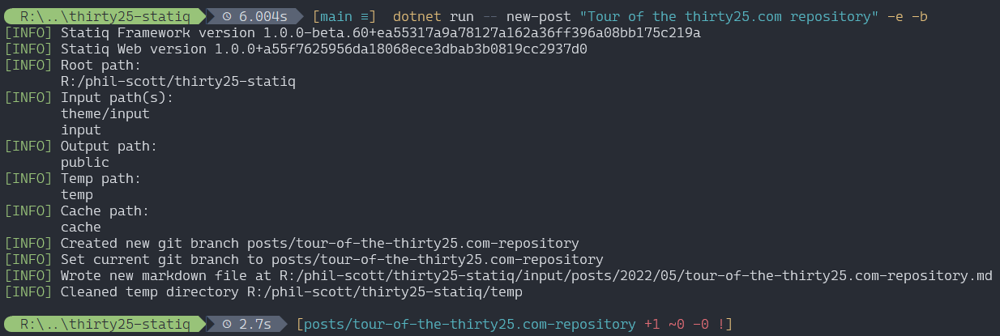
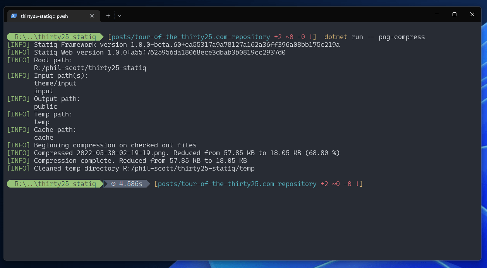
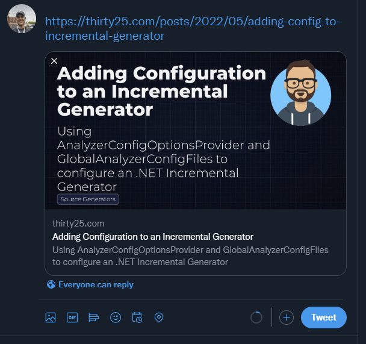

The repository for generating this site has quite a few features built on top of [statiq](https://www.statiq.dev/). You are welcome to fork it and use it for your own blog, but I wanted to document some of the features that might be overlooked or confusing.

Repository is located here https://github.com/phil-scott-78/thirty25-statiq. To run a live preview just run `dotnet run -- preview`

## `New-Post` command

It has a few helper commands, using Spectre.Console, to help maintain the site. new-post will create a new post with a title, description, its tags and date, then create a new branch and open vscode on the file.

To run execute

```bash
 dotnet run -- new-post -e -b "Tour of the thirty25.com repository"
```

The `-b` creates a new branch and `-e` launches VS Code. I like to put new posts in branches because it sometimes takes me way too long to get around to finishing them up, and often time I'm distracted and add new features to the blog instead.

https://github.com/phil-scott-78/thirty25-statiq/blob/main/Statiq/NewPostCommand.cs



png-compress is another command. It looks at all files edited or untracked for the current commit and uses TinyPng to compress them. You can find that command here.

https://github.com/phil-scott-78/thirty25-statiq/blob/main/Statiq/PngCompress.cs

## `Png-Compress` command

`png-compress` will send all .png files that are part of the current commit or untracked to tinypng.com's API. This is a relatively slow operation using a service with limits, so doing this on demand only for files that have been recently edited can keep our build time low while also being able to use the free tier from [tinypng's developer portal](https://tinypng.com/developers)

To use you'll need an API key from tinypng and set its value with a `TinyPngKey` environmental variable

https://github.com/phil-scott-78/thirty25-statiq/blob/main/Statiq/PngCompress.cs



## Roslyn highlighting

While the site is configured to use prism.js to highlight code blocks, prism relies on an out of date parser for C#. As new features are added to C# it lags behind significantly or doesn't support some parts of the language at all. So, instead we are using Roslyn to provide the color highlighting server side. This gets us better highlighting and better client perf as a bonus. Prism is left configured to highlight other code blocks such as SQL statements and Powershell.

https://github.com/phil-scott-78/thirty25-statiq/blob/main/Statiq/RoslynHighlightModule.cs

## Social cards

Social cards are generated for each post using an [ASP.NET razor file](https://github.com/phil-scott-78/thirty25-statiq/blob/main/Statiq/SocialCard.cshtml) to convert the razor output to a png using Playwright.



https://github.com/phil-scott-78/thirty25-statiq/blob/main/Statiq/Pipelines/SocialImages.cs

## MonorailCSS for the styling

There is no CSS or SASS files part of the repository. The CSS for the site is a utility-first CSS framework inspired by Tailwind named [MonorailCSS](https://github.com/monorailcss/MonorailCss.Framework). The pipeline gathers up all the CSS classes in the output files using AngleSharp and sends them to MonorailCss.Framework. MonorailCss takes those CSS classes and generates an appropriate stylesheet which is then persisted with the rest of the static site.

One gotcha for those looking to add this to your Statiq site - since it needs the full output of the site to work it is marked as part of the deployment process. If you are also running a deployment command like publishing to netlify you are likely to run into conditions where the publish command runs before the CSS generation.

https://github.com/phil-scott-78/thirty25-statiq/blob/main/Statiq/Pipelines/Monorail.cs

## Publish the site as a book

And finally the book output. The book is generated by gathering all the posts up and combining them into one document. That document is fed to a razor page that uses [paged.js](https://pagedjs.org/) to handle dividing the site up into a book format. It not only applies printer friendly styling, but also adds things like custom headers and footers, a table of contents, and footnotes containing the URLs for hyperlinks all with our specified page dimensions for printing.

This razor page is then hosted in a minimal ASPNET instance and Playwright is used to generate a PDF of the output.

https://github.com/phil-scott-78/thirty25-statiq/blob/main/Statiq/Pipelines/Book.cs

## Configuring Statiq

With this many custom hooks into Statiq, we need to tell the Statiq bootstrapper about them all. We also need to modify some of the default pipelines to either replace
or add in some of our own modules too.

```csharp
await Bootstrapper.Factory
    .CreateWeb(args)
    // used to link social cards from the layout page. They require an absolute path
    // including the domain name. This short code helps with that.
    .AddShortcode<FullUrlShortCode>("FullUrl")
    // The monorail pipeline takes in an instance of the CSS framework so we need to configure it.
    .ConfigureServices(i =>
    {
        i.AddSingleton(GetCssFramework());
    })
    // we need to modify the Content pipeline
    .ModifyPipeline(nameof(Content), pipeline =>
    {
        // the default GatherHeadings module doesn't include child content like code blocks, so we need to swap it with one
        // that is configured to parse all the nested elements.
        pipeline.ProcessModules
            .GetLast<CacheDocuments>().Children
            .GetLast<ExecuteIf>()[0]
            .ReplaceFirst<GatherHeadings>(_ => true, new GatherHeadings(2).WithNestedElements());
        // in addition to the archive pipeline we also have the book so make sure the regular content skips those too
        pipeline.ProcessModules
            .ReplaceFirst<FilterDocuments>(
                _ => true,
                new FilterDocuments(Config.FromDocument(doc => !Archives.IsArchive(doc) && !Book.IsBook(doc))));
        // include our custom highlighting module after the HTML has been generated in the process modules.
        pipeline.PostProcessModules.Add(new RoslynHighlightModule());
    })
    // the playwright nuget package relies on external resources like chrome to run. we can use the dotnet playwright
    // tool to install them.
    .AddProcess(ProcessTiming.Initialization,
        _ => new ProcessLauncher(dotnetPath, "tool restore") { LogErrors = false })
    .AddProcess(ProcessTiming.Initialization,
        _ => new ProcessLauncher(dotnetPath, "tool run playwright install chromium") { LogErrors = false })
    .RunAsync();
```
