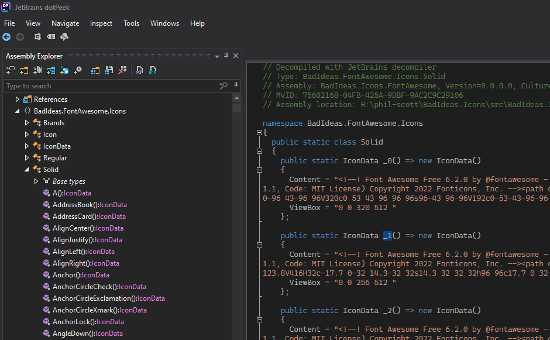
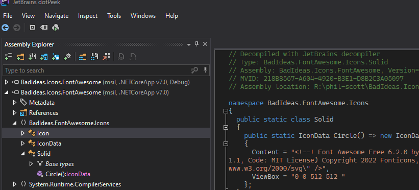

When it comes to using icons with Blazor there are lots of existing options out there. But they all seem to do one thing - wrap up the entirety of Font Awesome or some equivalent library. You get every icon with every style plus many times you also need to bring in a supporting javascript, CSS and maybe even a few fonts. Most of these JS libraries are written in such a way that something like webpack is going to minimize the JS that's included, but we don't have that luxury without some serious hacking about when it comes to Blazor.

## I wonder how I can keep my requests small?

For my use case I needed a couple of icons so the idea of multiple requests of over 400kb didn't sit well with me so I went down a different route. I really only need the content of the icon - ultimately it is just an svg element. I don't need javascript, and I don't really need CSS either - I have my own CSS framework that can add color or sizing to an HTML element.

So, on the front end of things a Blazor component that simply wrote out the SVG is all I really need. But I also want the ability to use any of the thousand icons of Font Awesome from my library.

## What if I relied on .NET trimming to keep it small?

[Trimming in .NET](https://learn.microsoft.com/en-us/dotnet/core/deploying/trimming/trim-self-contained) uses build time analysis to figure out what parts of an assembly are being called and only keep those parts. With .NET 6, trimming moved out of experimental support to being fully supported.

If I structured my icon library in such a way that it played nicely with the .NET trimming rules, the compiler should be able to see that I'm only needing, for example, the GitHub icon and a Home icon. Even if I have code in there for generating the thousand other icons at development time, when it comes time to publish the compiler would only keep the parts that the deployed app is using.

## Let's try!

To do the experiment, we need a Razor component that is exposed that will write out the SVG of the icon. At first I toyed with making each Icon its own Razor component. This proved a bit taxing on IDEs, plus the rules regarding [organizing via Namespaces](https://learn.microsoft.com/en-us/aspnet/core/blazor/components/?view=aspnetcore-7.0#namespaces) can be pretty restricting for keeping things tidy so this was a non-starter.

So I settled on having a single Icon component that has a property that takes in a struct containing the icon data. My component looks approximately like this with some extra code related to `AdditionalAttributes` stripped.

```csharp
using Microsoft.AspNetCore.Components;
using Microsoft.AspNetCore.Components.Rendering;

namespace App
{
    public class IconData
    {
        public string Content { get; init; }
        public string ViewBox { get; init; }
    }

    public class Icon : ComponentBase
    {
        [Parameter, EditorRequired]
        public IconData Item { get; set; } = null!

        protected override void BuildRenderTree(RenderTreeBuilder builder)
        {
            var viewBox = Item.ViewBox;
            var content = Item.Content;

            builder.OpenElement(0, "svg");
            builder.AddAttribute(1, "xmlns", "http://www.w3.org/2000/svg");
            builder.AddAttribute(2, "viewBox", viewBox);
            builder.AddMarkupContent(3, content);
            builder.CloseElement();
        }
    }
}
```

Now, we just need to expose every icon in a library as a method that returns `IconData`. You could use a T4 template, a build task or in my case I threw together a source generator. I'll leave that as an exercise to the reader but you can check out my solution in the repository linked at the bottom.

The end result is thousands of method calls that look like this

```csharp
public static class Solid
{
    public static IconData Circle() => new IconData()
    {
        Content = "(svg of the icon)",
        ViewBox = "0 0 512 512 "
    };

    // and thousands of other icons
}
```

Now to consume this library I just do something like so

```html
<Icon Item="@Solid.Circle()" class="w-25" />
```

The item will provide intellisense for all the available icons and we'll have a nice development experience.

The problem is when I go to compile, I now have a 4mb dll that contains every one of those methods.



Ouch.

## Trimming to the rescue.

Telling the compiler that our library is trimmable is easy enough

```xml
<PropertyGroup>
    <IsTrimmable>true</IsTrimmable>
</PropertyGroup>
```

Now, there are a [load of rules and things to test for a much more complicated library](https://learn.microsoft.com/en-us/dotnet/core/deploying/trimming/prepare-libraries-for-trimming#enable-project-specific-trimming). But we kept it simple, so we don't need to worry those. We just have a couple of classes with public methods so the compiler can make quick work of what is being called and what isn't.

That means when we publish via

```
dotnet publish -c Release
```

the output of our library is much different. It goes from 4mb down to 9kb! No third party javascript, no external fonts - just pure C# writing out the icons as a SVG.


